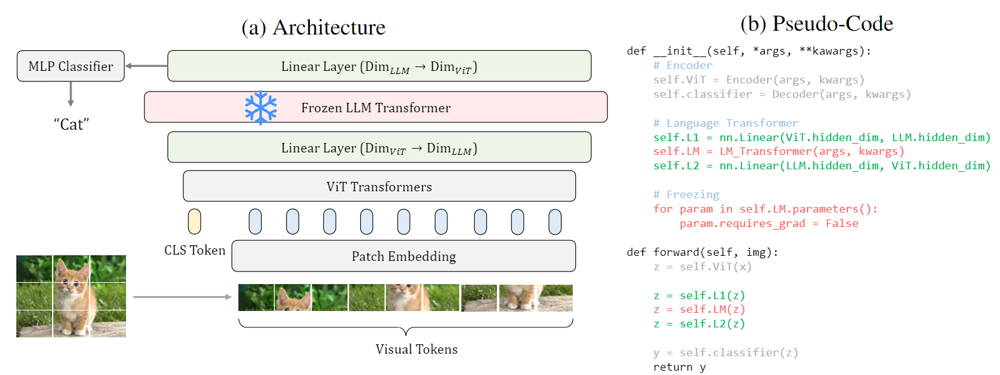
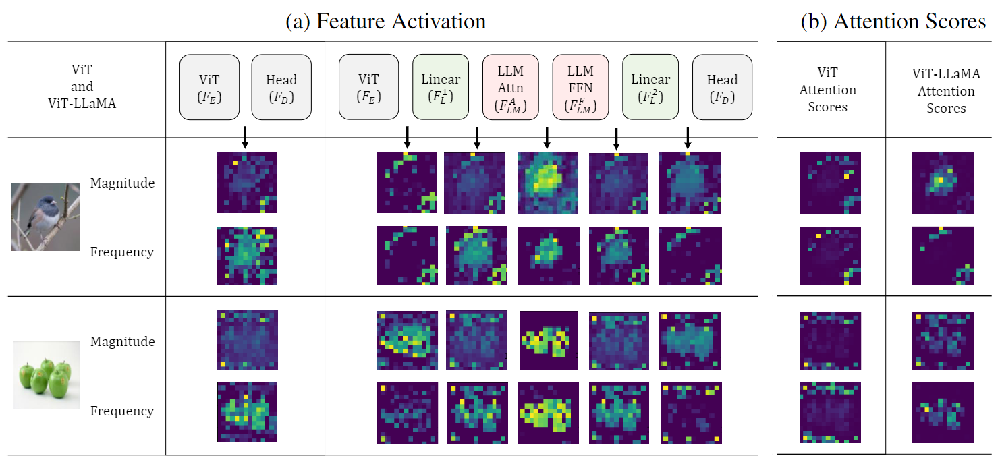

# Pretrained Transformers from Language Models for Visual Encoding

Official code implementation for "[Frozen Transformers in Language Models are Effective Visual Encoder Layers](https://arxiv.org/abs/2310.12973)"

[Ziqi Pang](https://ziqipang.github.io/), [Ziyang Xie*](https://ziyangxie.site/), [Yunze Man*](https://yunzeman.github.io/), [Yu-Xiong Wang](https://yxw.web.illinois.edu/)

If you find our paper or code helpful for your work, please consider cite by
```tex
@article{pang2023fozen,
  title={Frozen transformers in language models are effective visual encoder layers},
  author={Pang, Ziqi and Xie, Ziyang and Man, Yunze and Wang, Yu-Xiong},
  journal={arXiv preprint arXiv:2310.12973},
  year={2023}
}
```

## News

* `01/16/2024`: Papers accepted at ICLR 2024 (Spotlight). :tada:
* `11/01/2023`: Code release for point cloud classification.
* `10/24/2023`: Code release for action recognition.
* `10/19/2023`: Paper is available on Arxiv with initial code release on image classification.

## 1. Introduction

This paper reveals an intriguing discovery: **pretrained transformers from LLMs, despite being trained solely on textual data, are *surprisingly* strong encoders for *purely* visual tasks in the absence of language.** Our exploration shows the potential of LLMs as general-purpose *encoders* for *visual* data, as opposed to the previous usages of either pure *encoders* for text embeddings or *decoders* for tokenized outputs.

Our approach is straightforward yet overlooked: incorporating a **frozen** transformer block from a **pre-trained** LLM as a general-purpose visual **encoder** layer, directly processing the visual tokens. 

We intuitively illustrate our approach below (also Figure 1 in the paper). The procedure is as simple as three steps:

* Extract a frozen LLM transformer block and append it on top of the original visual encoder.
* Insert trainable linear layers before and after the added LLM block to align the feature dimensions.
* Freeze the LLM transformer while optimizing the other modules as usual during training.



To explain the benefits of using frozen LLM transformers, we further propose **information filtering hypothesis**: **the pre-trained LLM transformer blocks discern informative visual tokens and further amplify their contribution to the latent representation**. This is supported empirically from our observation that feature activation concentrated better on relevant regions as below (also Figure 3 in the paper).



## 2. Getting Started with the Experiments

We examine our discovery on a wide range of tasks and release their code in different directories:

- [x] [Image classification](./image_classification/README.md)
- [x] [Point cloud classification](./pointcloud_classification/README.md)
- [x] [Action recognition](./video_understanding/README.md)
- [ ] Motion forecasting
- [ ] 2D VQA and Image-Text Retrieval 
- [ ] 3D VQA

