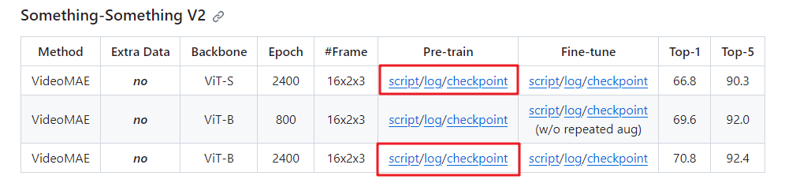

Put the checkpoints trained by MAE from VideoMAE. Our code then finetunes the whole model based on their pretrained weights.

The weights can be downloaded from VideoMAE's model zoo. Specifically
* Download the model `ViT-S` and `ViT-B` pretrained on SSv2 for 2400 epochs. (Follow the figure below to find the models in VideoMAE's model zoo.) 

* Name them as `videomae_ssv2_vits.pth` and `videomae_ssv2_vitb.pth`, respectively.